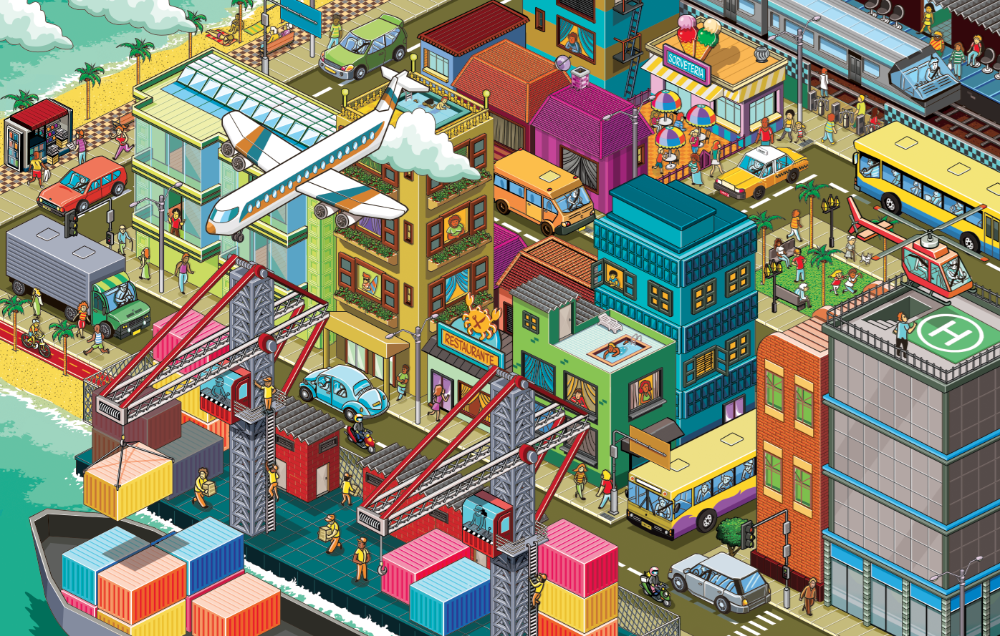
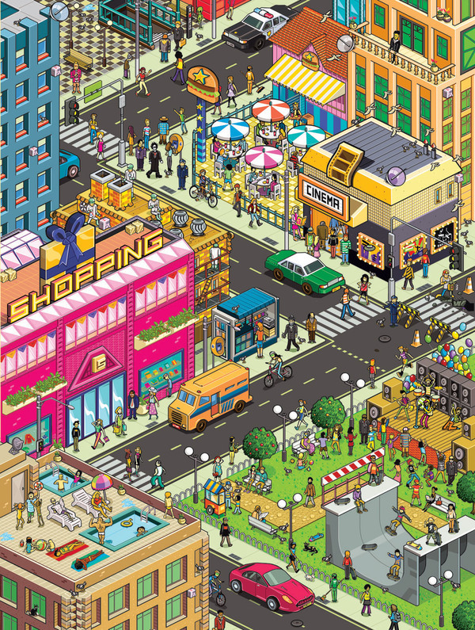

# Quiz 8

## Part 1: Imaging Technique Inspiration

The imaging technique that inspires me is pixel artwork, especially detailed isometric city scenes. I want to incorporate its bright colour palette, clean geometric structure, and layered arrangement of small characters, buildings, and objects. This style is useful for the assignment because it transforms a simple scene into something playful, visually rich, and inviting to explore. It particularly interests me because repeated shapes, grid systems, and modular elements can create depth and complexity without losing simplicity or a clear visual message.

### Inspiration Images

## Part 2: Coding Technique Exploration

The coding technique I would use is isometric grid drawing with repeated modular shapes. This is helpful because I can build the artwork from simple blocks, such as tiles, cubes, roads, or small building parts, instead of drawing every detail separately. It suits pixel art because the scene can stay neat, geometric, and consistent while still looking busy and detailed. It also supports pixel artwork technically by keeping spacing, alignment, and perspective consistent across many repeated elements, which helps a dense scene feel unified.

### Coding Technique Example

- Example implementation: [Happy Coding - Isometric Cubes](https://happycoding.io/tutorials/p5js/creating-classes/isometric-cubes)
- Example code: [p5.js Editor sketch by Kevin Workman](https://editor.p5js.org/KevinWorkman/sketches/sgLdEoU51)
